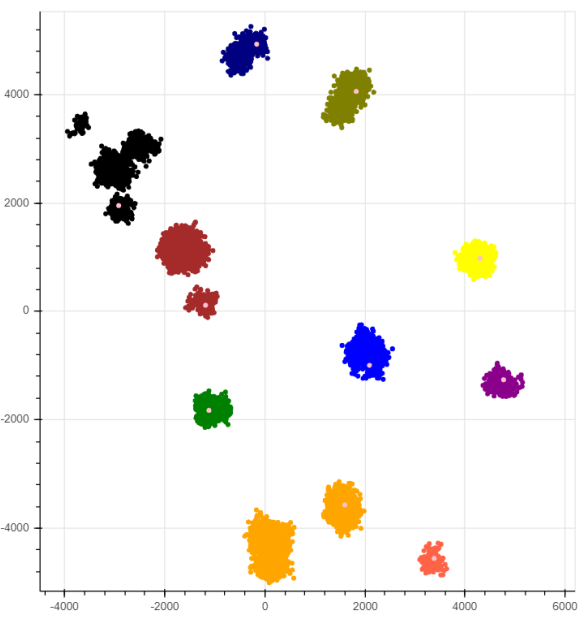

# Clustering

Implementácia 4 klastrovacých algoritmov na zhlukovanie 20020 bodov v 2D priestore. 
Tieto algoritmy porovnávame a výsledky zhlukovania graficky znázorňujeme. Za úspešný zhlukovač 
považujeme taký, v ktorom žiadny klaster nemá priemernú vzdialenosť bodov od stredu klastra väčšiu 
ako 500.
Algoritmy, ktoré implementujeme sú:

1. **K-means (centroid)**
2. **K-means (medoid)**
3. **Divízne zhlukovanie**
4. **Aglomeratívne zhlukovanie**

## Implementácia

Program je konzolová aplikácia, ktorá bola vytvorená v programovacom jazyku Python 3. Spúšťa sa 
súbor Main.py a to štandardne:
`$ python Main.py` \
Na grafické zobrazenie bola použitá knižnica/nástroj bokeh: https://bokeh.org